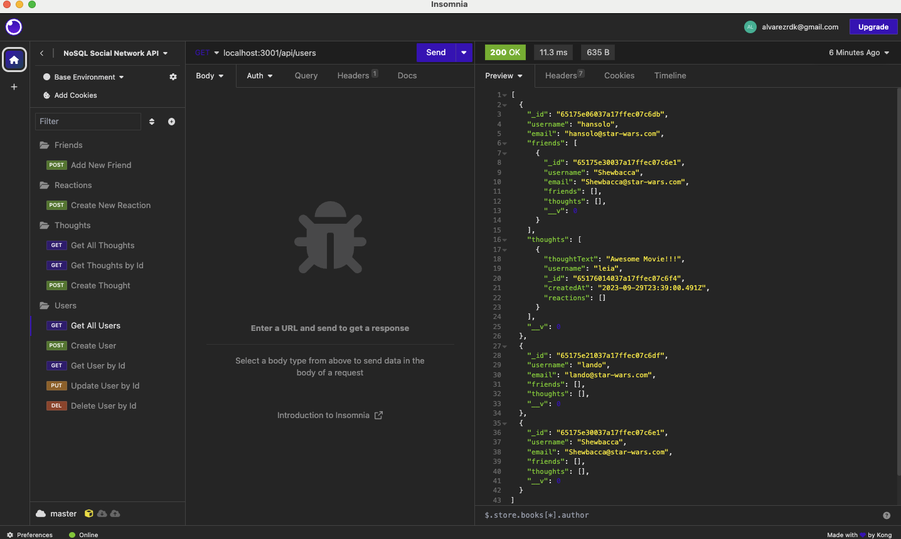

# NoSQl - Social Network API

## Description

This application is an NoSQL backend where users can share their thoughts, react to friends’ thoughts, and create a friend list. It was build using Express.js for routing, a MongoDB database, and the Mongoose ODM together with Express.js

the application fulfill the following Acceptance criteria:

GIVEN a social network API
WHEN I enter the command to invoke the application
THEN my server is started and the Mongoose models are synced to the MongoDB database
WHEN I open API GET routes in Insomnia for users and thoughts
THEN the data for each of these routes is displayed in a formatted JSON
WHEN I test API POST, PUT, and DELETE routes in Insomnia
THEN I am able to successfully create, update, and delete users and thoughts in my database
WHEN I test API POST and DELETE routes in Insomnia
THEN I am able to successfully create and delete reactions to thoughts and add and remove friends to a user’s friend list

## Installation
The application does not requires installation.

## Link to Video

https://drive.google.com/file/d/1r-aB1eZ2Q1bEBjaFX61s526GxlFdddBg/view

## Picture of the Application

## License
Please refer to the json file of this application. MIT.
 
